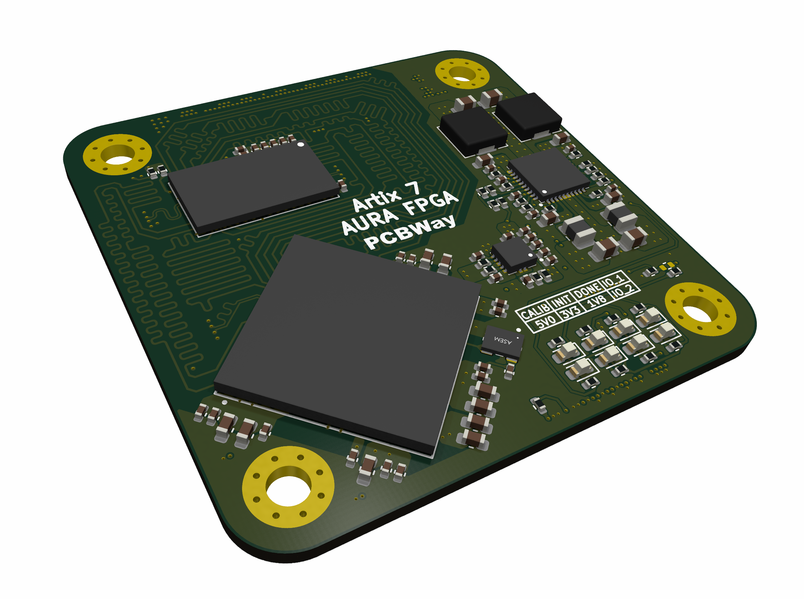

# AURA-FPGA

This repository is a project currently under development to make an Artix-7 FPGA based System on Module (SOM).

### Introduction

> **TODO** Write an introduction.

### PCB Design

> **TODO** Document PCB design, pin-out, and hardware user-guide.

### Vivado

> **TODO** Document block diagram design for pinout validation and to eventually run Petalinux.

> **TODO** Document IP configurations and notes (specifically MIG).

> **TODO** Document tcl build process.

### Petalinux

> **TODO** This is where any files/setup related to Petalinux will go.

### Software

> **TODO** This is where any bare metal microblaze code for Vitis will go.